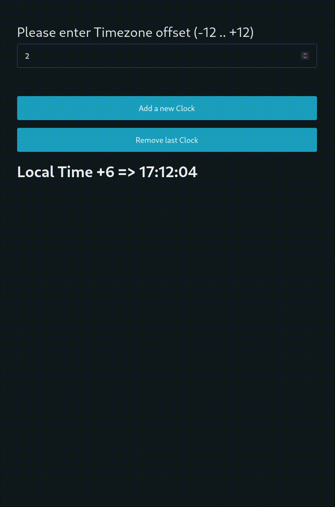

# Karax component example

This example is an implementation of a [Karax](https://github.com/karaxnim/karax) component-based app.

It's a simple *"world clock"*. You can create as many clocks you need, all running in different timezones.

Component **KClock** is stateful, so you can manage many of them independently in the same page.

To build it from source, just run

    nimble deps && nimble make

to install dependencies and compile the code. 

Then open index.html with your favourite browser, or simply [click here for a live example](https://ilmanzo.github.io/karax_clock/)

# Demo

